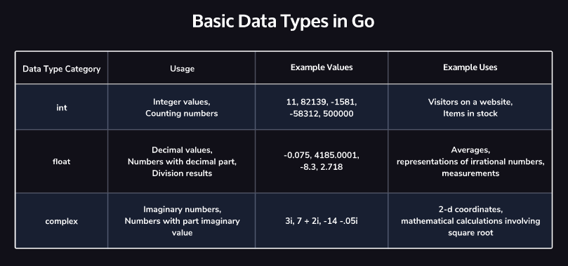
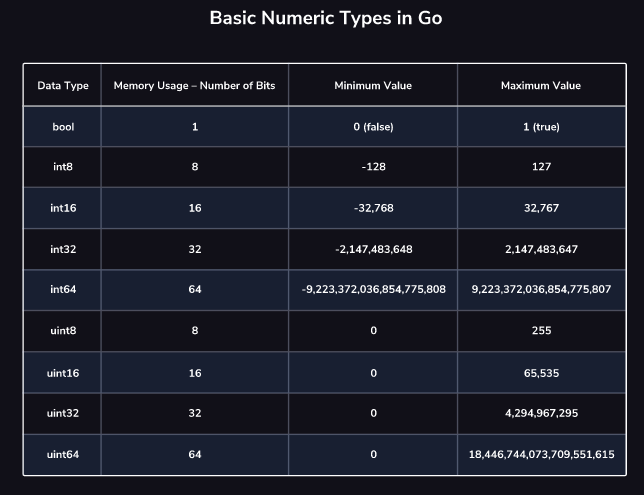

# Golang

Learning golang of [codeacademy](https://www.codecademy.com/courses/learn-go/lessons/learn-go-introduction) and uploading the exercises onto here to remember for later.

```bash
go run main.go
```

## Usage

```python
package main

import "fmt"

func main() {
	fmt.Println("Hello World.")
}
```

## Data Types




